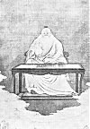

  
[Intangible Textual Heritage](../../index)  [Taoism](../index) 
[Index](index)  [Next](crv001) 

------------------------------------------------------------------------

# The Canon of Reason and Virtue

### (Lao-tze's Tao Teh King)

##### Chinese and English

## Translated by D.T. Suzuki & Paul Carus

#### Open Court

#### La Salle, Illinois

#### \[1913\]

###### Scanned at Intangible Textual Heritage, June 2004. John Bruno Hare, redactor. This text is in the public domain. These files may be used for any non-commercial purpose, provided this notice of attribution is left intact.

[  
Click to enlarge](img/front.jpg)

------------------------------------------------------------------------

[Next: Table of Contents](crv001)
