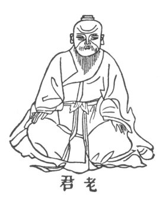

  
[Intangible Textual Heritage](../../index)  [Taoism](../index) 
[Index](index)  [Previous](crv004)  [Next](crv006) 

------------------------------------------------------------------------

p. 66

 

p. 67

# The Old Philosopher's Canon of Reason and Virtue

------------------------------------------------------------------------

[Next: Sze-ma-Ch'ien On Lao-tze](crv006)
