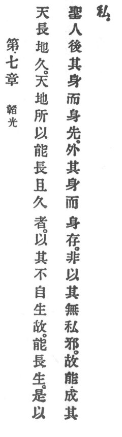

  
[Intangible Textual Heritage](../../index)  [Taoism](../index) 
[Index](index)  [Previous](crv012)  [Next](crv014) 

------------------------------------------------------------------------

### 7. DIMMING RADIANCE.

|                    |
|--------------------|
|  |

1\. Heaven endures and earth is lasting. And why can heaven and earth
endure and be lasting? Because they do not live for themselves. On that
account can they endure.

2\. Therefore

The holy man puts his person behind and his person comes to the front.
He surrenders his person and his person is preserved. Is it not because
he seeks not his own? For that reason he can accomplish his own.

------------------------------------------------------------------------

[Next: 8. Easy By Nature](crv014)
