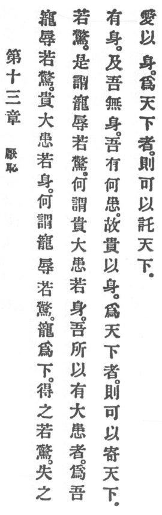

  
[Intangible Textual Heritage](../../index)  [Taoism](../index) 
[Index](index)  [Previous](crv018)  [Next](crv020) 

------------------------------------------------------------------------

### 13. LOATHING SHAME.

|                    |
|--------------------|
|  |

1\. "Favor bodes disgrace; it is like trembling.  
Rank bodes great heartache. It is like the body."

p. 81

2\. What means "Favor bodes disgrace; it is like trembling?"

Favor humiliates. Its acquisition causes trembling, its loss causes
trembling. This is meant by "Favor bodes disgrace; it is like
trembling."

3\. What means "Rank bodes great heartache, it is like the body?"

I suffer great heartache because I have a body. When I have no body,
what heartache remains?

4\. Therefore who administers the empire as he takes care of his body
can be entrusted with the empire.

------------------------------------------------------------------------

[Next: 14. Praising the Mysterious](crv020)
