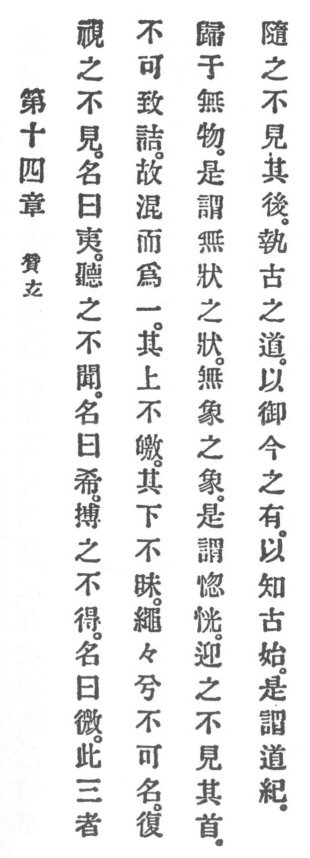

  
[Intangible Textual Heritage](../../index)  [Taoism](../index) 
[Index](index)  [Previous](crv019)  [Next](crv021) 

------------------------------------------------------------------------

### 14. PRAISING THE MYSTERIOUS.

|                    |
|--------------------|
|  |

1\. We look at Reason and do not see it; its name is Colorless. We
listen to Reason and do not hear it; its name is Soundless. We grope for
Reason and do not grasp it; its name is Bodiless.

2\. These three things cannot further be analyzed. Thus they are
combined and conceived as a unity which on its surface is not clear and
in its depth not obscure.

3\. Forever and aye Reason remains unnamable, p.
82 and again and again it returns home to non-existence.

4\. This is called the form of the formless, the image of the imageless.
This is called the transcendentally abstruse.

5\. In front its beginning is not seen. In the rear its end is not seen.

6\. By holding fast to the Reason of the ancients, the present is
mastered and the origin of the past understood. This is called Reason's
clue.

------------------------------------------------------------------------

[Next: 15. The Revealers of Virtue](crv021)
