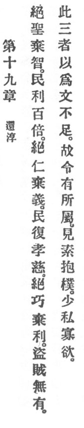

  
[Intangible Textual Heritage](../../index)  [Taoism](../index) 
[Index](index)  [Previous](crv024)  [Next](crv026) 

------------------------------------------------------------------------

### 19. RETURNING TO SIMPLICITY.

|                    |
|--------------------|
|  |

1\. Abandon your saintliness; put away your prudence; and the people
will gain a hundredfold!

2\. Abandon your benevolence; put away your justice; and the people will
return to filial piety and paternal devotion.

3\. Abandon smartness; give up greed; and thieves and robbers will no
longer exist.

4\. These are three things for which culture is insufficient. Therefore
it is said:

"Hold fast to that which will endure,  
Show thyself simple, preserve thee pure,  
And lessen self with desires fewer."

 

------------------------------------------------------------------------

[Next: 20. Different from the Vulgar](crv026)
