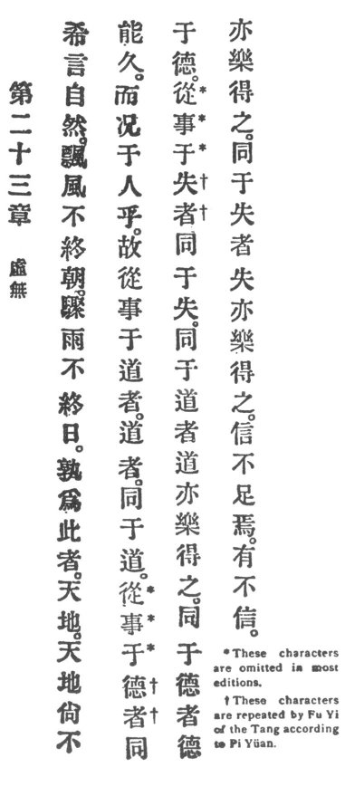

  
[Intangible Textual Heritage](../../index)  [Taoism](../index) 
[Index](index)  [Previous](crv028)  [Next](crv030) 

------------------------------------------------------------------------

### 23. EMPTINESS AND NON-EXISTENCE.

|                    |
|--------------------|
|  |

1\. To be taciturn is the natural way. A hurricane: does not outlast the
morning. p. 89A cloudburst does not outlast
the day.

2\. Who causes these events but heaven and earth? If even heaven and
earth cannot be unremitting, will not man be much less so?

3\. Those who pursue their business in Reason, men of Reason, associate
in Reason. Those who pursue their business in virtue associate in
virtue. Those who pursue their business in ill luck associate in ill
luck. When men associate in Reason, Reason makes them glad to find
companions. When men associate in virtue, virtue makes them glad to find
companions. When men associate in ill luck, ill luck makes them glad to
find companions.

"If your faith is insufficient, verily shall ye receive no faith."

------------------------------------------------------------------------

[Next: 24. Trouble From Indulgence](crv030)
