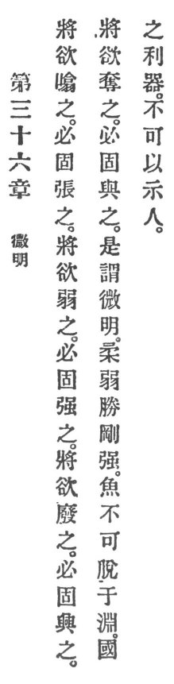

  
[Intangible Textual Heritage](../../index)  [Taoism](../index) 
[Index](index)  [Previous](crv041)  [Next](crv043) 

------------------------------------------------------------------------

### 36. THE SECRET'S EXPLANATION.

|                    |
|--------------------|
|  |

1\. That which is about to contract has surely been expanded. That which
is about to weaken has surely been strengthened. That which is about to
fall has surely been raised. That which is about to be despoiled has
surely been endowed.

2\. This is an explanation of the secret that the tender and the weak
conquer the hard and the strong.

3\. As the fish should not escape from the deep, so with the country's
sharp tools the people should not become acquainted.

------------------------------------------------------------------------

[Next: 37. Administration of Government](crv043)
