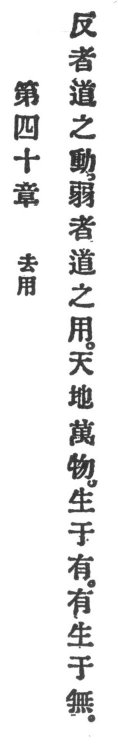

  
[Intangible Textual Heritage](../../index)  [Taoism](../index) 
[Index](index)  [Previous](crv045)  [Next](crv047) 

------------------------------------------------------------------------

### 40. AVOIDING ACTIVITY.

|                    |
|--------------------|
|  |

1\. "Homeward is Reason's course,  
Weakness is Reason's force."

2\. Heaven and earth and the ten thousand things come from existence,
but existence comes from non-existence.

------------------------------------------------------------------------

[Next: 41. Sameness in Difference](crv047)
