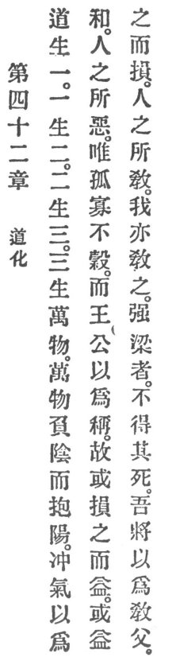

  
[Intangible Textual Heritage](../../index)  [Taoism](../index) 
[Index](index)  [Previous](crv047)  [Next](crv049) 

------------------------------------------------------------------------

### 42. REASON'S MODIFICATIONS.

|                    |
|--------------------|
|  |

1\. Reason begets unity; unity begets duality; duality begets trinity;
and trinity begets the ten thousand things.

p. 104

2\. The ten thousand things are sustained by Yin \[the negative
principle\]; they are encompassed by Yang \[the positive principle\],
and the immaterial breath renders them harmonious.

3\. That which the people find odious, to be orphaned, lonely, and
unworthy, kings and princes select as their titles. Thus, on the one
hand, loss implies gain, and on the other hand, gain implies loss.

4\. What others have taught I teach also.

5\. The strong and aggressive do not die a natural death; but I will
obey the doctrine's father.

------------------------------------------------------------------------

[Next: 43. Its Universal Application](crv049)
