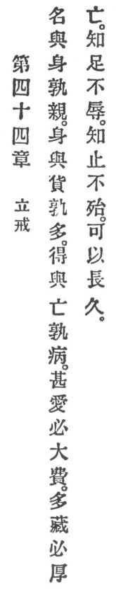

  
[Intangible Textual Heritage](../../index)  [Taoism](../index) 
[Index](index)  [Previous](crv049)  [Next](crv051) 

------------------------------------------------------------------------

p. 105

### 44. SETTING UP PRECEPTS.

|                    |
|--------------------|
|  |

1\. "Name or person, which is more near?  
Person or fortune, which is more dear?  
Gain or loss, which is more sear?

2\. "Extreme dotage leadeth to squandering.  
Hoarded wealth inviteth plundering.

3\. "Who is content incurs no humiliation,  
Who knows when to stop risks no vitiation,  
Forever lasteth his duration."

 

------------------------------------------------------------------------

[Next: 45. Greatest Virtue](crv051)
