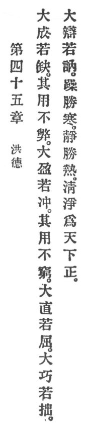

  
[Intangible Textual Heritage](../../index)  [Taoism](../index) 
[Index](index)  [Previous](crv050)  [Next](crv052) 

------------------------------------------------------------------------

### 45. GREATEST VIRTUE.

|                    |
|--------------------|
|  |

1\. "Greatest perfection imperfect will be,  
But its work ne'er waneth.  
Greatest fulness is vacuity,  
Its work unexhausted remaineth."

2\. "Straightest lines resemble curves;  
Greatest skill like a tyro serves;  
Greatest eloquence stammers and swerves."

3\. Motion conquers cold. Quietude p. 106
conquers heat. Purity and clearness are the world's standard.

------------------------------------------------------------------------

[Next: 46. Moderation of Desire](crv052)
