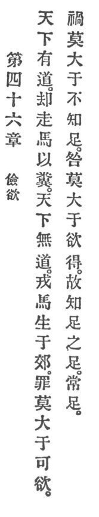

  
[Intangible Textual Heritage](../../index)  [Taoism](../index) 
[Index](index)  [Previous](crv051)  [Next](crv053) 

------------------------------------------------------------------------

### 46. MODERATION OF DESIRE.

|                    |
|--------------------|
|  |

1\. When the world possesses Reason, race horses are reserved for
hauling dung. When the world is without Reason, war horses are bred in
the common.

2\. No greater sin than yielding to desire. No greater misery than
discontent. No greater calamity than greed.

3\. Therefore, he who knows content's content is always content.

------------------------------------------------------------------------

[Next: 47. Viewing the Distant](crv053)
