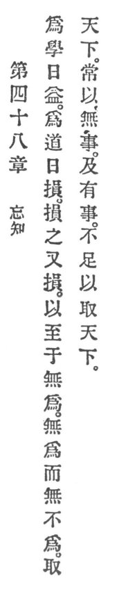

  
[Intangible Textual Heritage](../../index)  [Taoism](../index) 
[Index](index)  [Previous](crv053)  [Next](crv055) 

------------------------------------------------------------------------

p. 107

### 48. FORGETTING KNOWLEDGE.

|                    |
|--------------------|
|  |

1\. He who seeks learnedness will daily increase. He who seeks Reason
will daily diminish. He will diminish and continue to diminish until he
arrives at non-assertion.

2\. With non-assertion there is nothing that he cannot achieve. When he
takes the empire, it is always because he uses no diplomacy. He who uses
diplomacy is not fit to take the empire.

------------------------------------------------------------------------

[Next: 49. Trust in Virtue](crv055)
