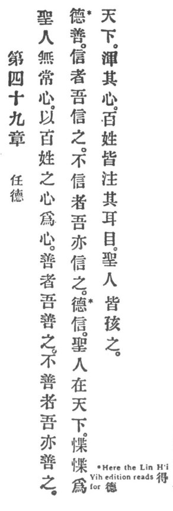

  
[Intangible Textual Heritage](../../index)  [Taoism](../index) 
[Index](index)  [Previous](crv054)  [Next](crv056) 

------------------------------------------------------------------------

### 49. TRUST IN VIRTUE.

|                    |
|--------------------|
|  |

1\. The holy man has not a heart of his own. The hundred families'
hearts he makes his heart.

2\. The good I meet with goodness; the bad I also meet with goodness;
that is virtue's goodness. The faithful I meet with faith; the faithless
I also meet with faith; that is virtue's faith.

3\. The holy man dwells in the world anxious, very anxious in his
dealings with the world. He universalizes his heart, and the hundred
families fix upon p. 108 him their ears and
eyes. The holy man treats them all like children.

------------------------------------------------------------------------

[Next: 50. The Estimation of Life](crv056)
