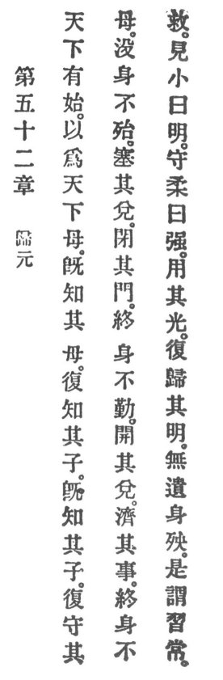

  
[Intangible Textual Heritage](../../index)  [Taoism](../index) 
[Index](index)  [Previous](crv057)  [Next](crv059) 

------------------------------------------------------------------------

### 52. RETURNING TO THE ORIGIN.

|                    |
|--------------------|
|  |

1\. When the world takes its beginning, Reason becomes the world's
mother.

2\. As one knows his mother, so she in turn knows her child; as she
quickens her child, so he in turn keeps to his mother, and to the end of
life he is not in danger. Who closes his mouth, and shuts his
sense-gates, in the end of life he will encounter no trouble; but who
opens his mouth and meddles with affairs, p.
110 in the end of life he cannot be saved.

3\. Who beholds his smallness is called enlightened. Who preserves his
tenderness is called strong. Who uses Reason's light and returns home to
its enlightenment does not surrender his person to perdition. This is
called practising the eternal.

------------------------------------------------------------------------

[Next: 53. Gaining Insight](crv059)
