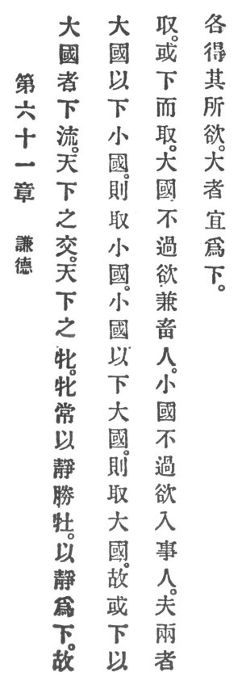

  
[Intangible Textual Heritage](../../index)  [Taoism](../index) 
[Index](index)  [Previous](crv066)  [Next](crv068) 

------------------------------------------------------------------------

### 61. THE VIRTUE OF HUMILITY.

|                    |
|--------------------|
|  |

1\. A great state, one that lowly flows, becomes the empire's union, and
the empire's wife.

2\. The wife always through quietude conquers her husband, and by
quietude renders herself lowly.

3\. Thus a great state through lowliness toward small states will
conquer the small states, and small states through lowliness toward
great states will conquer great states.

4\. Therefore some render themselves p. 117
lowly for the purpose of conquering; others are lowly and therefore
conquer.

5\. A great state desires no more than to unite and feed the people; a
small state desires no more than to devote itself to the service of the
people; but that both may obtain their wishes, the greater one must
stoop.

------------------------------------------------------------------------

[Next: 62. Practise Reason](crv068)
