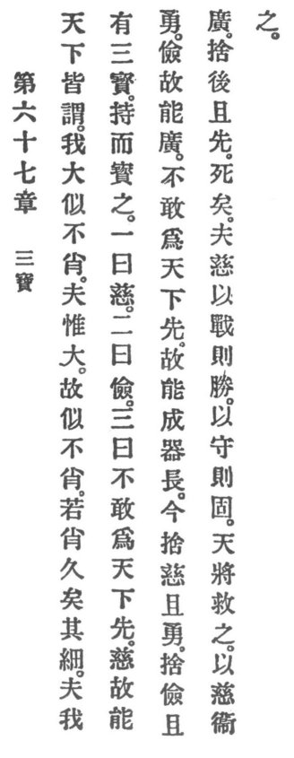

  
[Intangible Textual Heritage](../../index)  [Taoism](../index) 
[Index](index)  [Previous](crv072)  [Next](crv074) 

------------------------------------------------------------------------

### 67. THE THREE TREASURES.

|                    |
|--------------------|
|  |

1\. All in the world call me great; but I resemble the unlikely. Now a
man is great only because he resembles the unlikely. Did he resemble the
likely, how lasting, indeed, would his mediocrity be!

2\. 1 have three treasures which I p. 122
cherish and prize. The first is called compassion. The second is called
economy. The third is called not daring to come to the front in the
world.

3\. The compassionate can be brave; the economical can be generous;
those who dare not come to the front in the world can become perfect as
chief vessels.

4\. Now, if people discard compassion and are brave; if they discard
economy and are generous; if they discard modesty and are ambitious,
they will surely die.

5\. Now, the compassionate will in attack be victorious, and in defence
firm. Heaven when about to save one will with compassion protect him.

------------------------------------------------------------------------

[Next: 68. Complying With Heaven](crv074)
