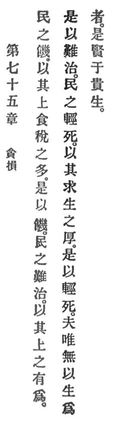

  
[Intangible Textual Heritage](../../index)  [Taoism](../index) 
[Index](index)  [Previous](crv080)  [Next](crv082) 

------------------------------------------------------------------------

### 75. HARMED THROUGH GREED.

|                    |
|--------------------|
|  |

1\. The people hunger because their superiors consume too many taxes;
therefore they hunger. The people are difficult to govern because their
superiors are too meddlesome; therefore they are difficult to govern.
The people make light of death on account of the intensity of their
clinging to life; therefore they make light of death.

2\. He who is not bent on life is worthier than he who esteems life.

------------------------------------------------------------------------

[Next: 76. Beware of Strength](crv082)
