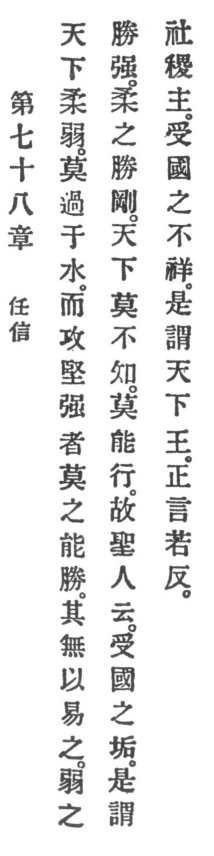

  
[Intangible Textual Heritage](../../index)  [Taoism](../index) 
[Index](index)  [Previous](crv083)  [Next](crv085) 

------------------------------------------------------------------------

### 78. TRUST IN FAITH.

|                    |
|--------------------|
|  |

1\. In the world nothing is tenderer and more delicate than water. In
attacking the hard and the strong nothing will surpass it. There is
nothing that herein takes its place.

2\. The weak conquer the strong, the tender conquer the rigid. In the
world there is no one who does not know it, but no one will practise it.

3\. Therefore the holy man says:

"Him who the country's sin makes his,  
We hail as priest at the great sacrifice.  
Him who the curse bears of the country's failing.  
As king of the empire we are hailing."

4\. True words seem paradoxical.

------------------------------------------------------------------------

[Next: 79. Keep Your Obligations](crv085)
