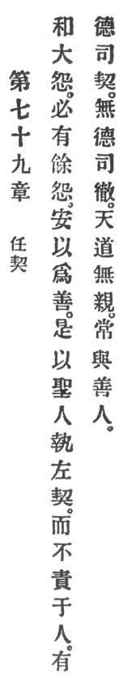

  
[Intangible Textual Heritage](../../index)  [Taoism](../index) 
[Index](index)  [Previous](crv084)  [Next](crv086) 

------------------------------------------------------------------------

p. 129

### 79. KEEP YOUR OBLIGATIONS.

|                    |
|--------------------|
|  |

1\. When a great hatred is reconciled, naturally some hatred will
remain. How can this be made good?

2\. Therefore the sage keeps the obligations of his contract and exacts
not from others. Those who have virtue attend to their obligations;
those who have no virtue attend to their claims.

3\. Heaven's Reason shows no preference but always assists the good man.

------------------------------------------------------------------------

[Next: 80. Remaining in Isolation](crv086)
