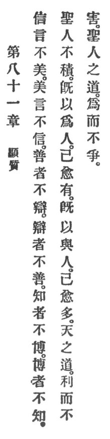

  
[Intangible Textual Heritage](../../index)  [Taoism](../index) 
[Index](index)  [Previous](crv086)  [Next](crv088) 

------------------------------------------------------------------------

### 81. PROPOUNDING THE ESSENTIAL.

|                    |
|--------------------|
|  |

1\. True words are not pleasant; pleasant words are not true. The good
are not contentious; the contentious are not good. The wise are not
learned; the learned are not wise.

2\. The holy man hoards not. The more he does for others, the more he
owns himself. The more he gives to others, the more will he himself lay
up an abundance.

3\. Heaven's Reason is to benefit but not to injure; the holy man's
Reason is to accomplish but not to strive.

------------------------------------------------------------------------

[Next: Chapter I.](crv088)
