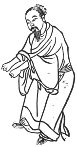
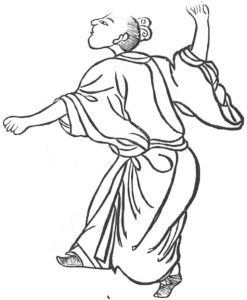
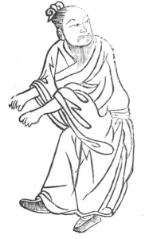
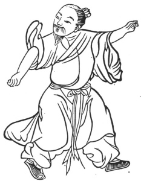
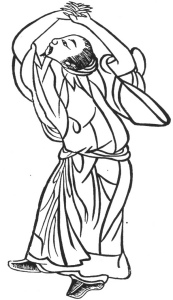

  
[Intangible Textual Heritage](../../index)  [Taoism](../index) 
[Index](index)  [Previous](kfu002)  [Next](kfu004) 

------------------------------------------------------------------------

  
*Kung-Fu, or Tauist Medical Gymnastics*, by John Dudgeon, \[1895\], at
Intangible Textual Heritage

------------------------------------------------------------------------

p. 112

### The Five Animals.

These figures for the cure of disease by perspiration were designed by
the celebrated surgeon Hwa-to, of the Han dynasty (2nd century A.D.),
who is not only the Esculapius of China but was well versed in all the
secrets of Tauism. He was wondrously skilled in acupuncture, and some of
his surgical operations are of a very marvellous description. He was.
the first to use anæsthetics in scraping the poison from the arm of
Kwan-ti, the god of war and patron of the present dynasty. If one's body
is not in health and peace, the performance of these five figures will
produce perspiration and cure the disease and discomfort.

Figure 1.—*The Tiger*. Close the breath, bend the head, close the fists
tightly, and assume the severe form of a tiger. The two hands are slowly
to lift a supposed weight of 1000 catties; the breath is to be retained
till the body is upright, then swallowed and carried down into the
abdomen. This is to cause the "divine air" (animal spirits, energy) to
proceed from above downwards and produce in the abdomen a sound like
thunder; to be done some 7 times. By this sort of movement,

p. 113

the air and pulses of the body will be harmonized, and the hundred (all)
diseases prevented from being produced.

 

p. 114

Figure 2.—*The Bear*. Assume the form of a bear, incline the body
slightly to the side, swing it to the right and left, place one foot in
front and one behind, and stand fast. Use the air till the ribs on the
two sides and the joints all resound. Also, move the strength of the
loins to remove the swelling (?) some 3 to 5 times. This will relax and
tranquilize the tendons and bones. This also is the method for
nourishing the blood.

 

p. 115

Figure 3.—*The Deer*. Shut the breath, bend the head, close the fists
tightly, turn the head like a deer viewing its tail; the body even,
contract the shoulders, stand on tip-toe, stamp on the heel, and
including the "heavenly pillar" (the neck) the entire body will move; do
it some 3 times, or each day once will also do. To do it once, on
getting out of bed in the morning, is the best of all.

 

p. 116

Figure 4.—*The Monkey*. Stop the breath, assume the form of a monkey
climbing a tree, one hand as it were holding some fruit, one foot
raised; on the heel of one

 

p. 117

foot turn the body, and cause the "divine air" to revolve, [\*](#fn_1) carrying it into the abdomen till you feel
perspiration is .exuding, and then it is finished.

Figure 5.—*The Bird*. Close the breath, assume the form of a bird
flying, raise the head, inspire the air of the coccyx, and cause it to
ascend to the hollow of the vertex (head); let the two hands assume in
front \[the attitude of\] reverence \[or worship\], raise the head

p. 118

(so as to have the face upwards), and go out to meet the spirit and
break the vertex (*i.e.*, open the brain, as it were, to receive it).

 

------------------------------------------------------------------------

### Footnotes

[117:\*](kfu003.htm#fr_1) The expression yün-ch‘i
(\#) occurs in almost every exercise. In fact, without this there is
properly speaking no *kung* (\#), It is the very essence of the art, and
the greatest stress is laid upon it. Its impossibility, absurdity, and
uselessness, even if possible, do not require to be demonstrated. The
benefit which is derived is from the exercise in attempting the
impossible. Man is considered a "little heaven." The pure air is
inspired, and, by swallowing it with effort, it is carried down to the
navel or *tan tien*—an imaginary spot one inch below the navel—thence to
the coccyx, where there is an aperture which in young persons is
pervious but in old persons is filled up with fat; thence up the back,
past the "double barrier" to the occiput; then over the vertex to the
"heavenly door" (the brow), and finally finds egress by the nostrils as
foul air. This is performing a revolution of the microcosm, and that
which is denoted by *yün-ch‘i*. The Tauists prefer the retirement in the
monasteries in the hills to go through these exercises, as the air there
is pure.

------------------------------------------------------------------------

[Next: Introduction](kfu004)
