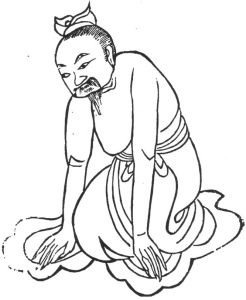

  
[Intangible Textual Heritage](../../index)  [Taoism](../index) 
[Index](index)  [Previous](kfu016)  [Next](kfu018) 

------------------------------------------------------------------------

  
*Kung-Fu, or Tauist Medical Gymnastics*, by John Dudgeon, \[1895\], at
Intangible Textual Heritage

------------------------------------------------------------------------

13.—*For the Solar Term of the Seventh Month, called "Beginning of
Autumn."*—Both hands to the ground, contract the body, close the breath,
raise up the body in a jerking manner 7 × 8 times, etc. To fill up the
empty (weak) and injured parts, to dispel the air of the loins and
kidneys collected there, the heart and ribs painful and so unable to
turn the body, the face as if covered with fine dust, the outside of the
foot hot, head-ache, jaws painful, eyes projecting, canthi painful,
sternum and. arm-pits swollen and painful, paroxysms of cold
perspiration. (See Figure).

 

------------------------------------------------------------------------

[Next: 14.—For the Middle of the Seventh Month, termed 'Stopping of
Heat.'](kfu018)
