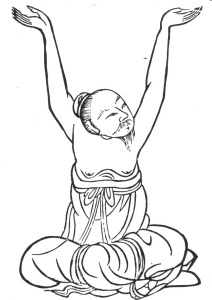
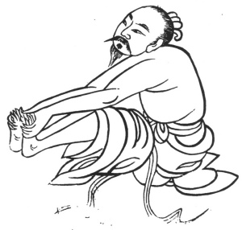
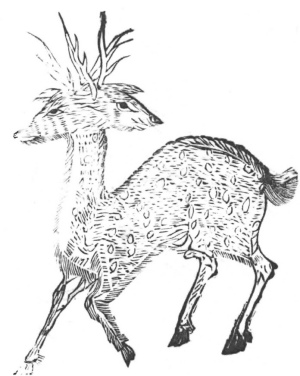

  
[Intangible Textual Heritage](../../index)  [Taoism](../index) 
[Index](index)  [Previous](kfu021)  [Next](kfu023) 

------------------------------------------------------------------------

  
*Kung-Fu, or Tauist Medical Gymnastics*, by John Dudgeon, \[1895\], at
Intangible Textual Heritage

------------------------------------------------------------------------

 

p. 145

18.—*Middle of the Ninth Month, termed "Frosts Descent."*—Seated even,
extend both hands and seize the feet; and, accompanying this exercise,
use strength in the middle of the feet, then relax and withdraw the
hands 5 × 7 times, etc. To cure wind and damp having entered the loins,
[inability](errata.htm#7) to extend and flex the feet and thighs,
painful joints, lower part of leg painful as if laid open, painful head,
back, loins, pelvis, thighs, knees, muscular paralysis, lower portion of
body swollen, evacuation of pus and blood (dysentery), the small abdomen
distended and painful, difficult and painful micturition, tendons cold,
gout, hæmorrhoids, prolapsus ani. (See Figure).

 

p. 146

The kidneys form the illustration at the beginning of the last three
months of the year, which is as follows:—The name of its spirit is "The
Water Spirit," and its designation "Nourishing Infants." Its form is
that of a yellow deer with two heads. It stores up the will. It
resembles a round stone, is of two colours like white silk reflected on
purple. It is placed opposite the navel, and lies in close contact with
the lumbar spine. The left kidney is the real one, and mates with the
five viscera. The right kidney is called the Ming Men (\#) or "Gate of
Life," and in the male secretes the semen, in the female the fœtal
membrane. The pulse of the kidney issues from the middle of the soles of
the feet. (See illustration).

 

------------------------------------------------------------------------

[Next: 19.—The Solar Term of the Tenth Month, called 'Beginning of
Winter.'](kfu023)
