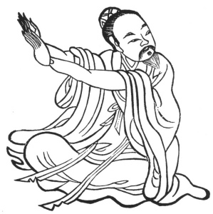

  
[Intangible Textual Heritage](../../index)  [Taoism](../index) 
[Index](index)  [Previous](kfu022)  [Next](kfu024) 

------------------------------------------------------------------------

  
*Kung-Fu, or Tauist Medical Gymnastics*, by John Dudgeon, \[1895\], at
Intangible Textual Heritage

------------------------------------------------------------------------

p. 147

19.—*The Solar Term of the Tenth Month, called "Beginning of
Winter."*—Seated upright, one hand on the knee, one hand grasping the
elbow, change right and left and support the right and left 3 × 5 times,
etc. To cure the *hsü-lao* (empty toil, consumption) and vicious poison
in the chest and ribs, fulness of the thorax, loins painful, neither
able to bend nor straighten \[the body\], deficiency of saliva, face
dusky, nausea and hiccough, indigested fæcal motions, head-ache,
deafness, jaws swollen, eyes red swollen and painful, sense of fulness
and depression in abdomen and ribs and the four extremities, vertigo,
pupils painful. (See Figure).

 

------------------------------------------------------------------------

[Next: 20.—For the Middle of the Tenth Month, termed 'Slight
Snow.'](kfu024)
