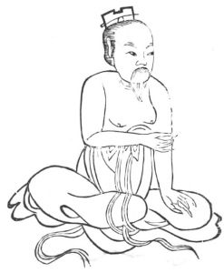

  
[Intangible Textual Heritage](../../index)  [Taoism](../index) 
[Index](index)  [Previous](kfu023)  [Next](kfu025) 

------------------------------------------------------------------------

  
*Kung-Fu, or Tauist Medical Gymnastics*, by John Dudgeon, \[1895\], at
Intangible Textual Heritage

------------------------------------------------------------------------

p. 148

20.—*For the Middle of the Tenth Month, termed "Slight Snow."*—One hand
placed on the knee, the other grasping the elbow, right and left using
force 3 × 5 times, etc. To cure wind, damp, and warm poison of the wrist
and elbow, a wife's enlargement of the small abdomen and a husband's
hernia, fox (?) hernia (all sorts of hernia), incontinence of urine,
swelling of the joints, contraction of tendons, small membrum virile,
five sorts of gonorrhœa (wind, fire, cold, poison, damp), diarrhœa,
fear, fulness of the chest, asthma of the lower ribs. (See Figure).

 

------------------------------------------------------------------------

[Next: 21.—For the Solar Term of the Eleventh Month, named 'Great
Snow.'](kfu025)
