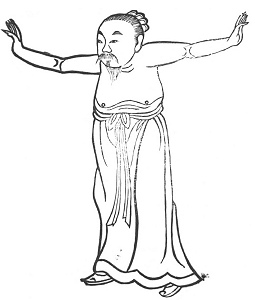

  
[Intangible Textual Heritage](../../index)  [Taoism](../index) 
[Index](index)  [Previous](kfu024)  [Next](kfu026) 

------------------------------------------------------------------------

  
*Kung-Fu, or Tauist Medical Gymnastics*, by John Dudgeon, \[1895\], at
Intangible Textual Heritage

------------------------------------------------------------------------

p. 149

21.—*For the Solar Term of the Eleventh Month, named "Great
Snow."*—Standing straight, the knees extended, both hands to the right
and left as if supporting the two feet, right and left stamping, each 5
× 7 times, etc. To cure wind and dampness of the feet and knees, heat of
the mouth, dryness of the tongue, swelling of the throat, jaundice,
hungry, and cannot eat, cough, hæmoptysis, asthma, vision indistinct,
fear (as if about to be seized).—See Figure.

 

------------------------------------------------------------------------

[Next: 22.—For the Middle of the Eleventh Month, called 'Winter
Solstice.'](kfu026)
