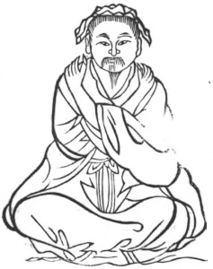

  
[Intangible Textual Heritage](../../index)  [Taoism](../index) 
[Index](index)  [Previous](kfu030)  [Next](kfu032) 

------------------------------------------------------------------------

  
*Kung-Fu, or Tauist Medical Gymnastics*, by John Dudgeon, \[1895\], at
Intangible Textual Heritage

------------------------------------------------------------------------

p. 155

No. 3.—Hsü Shên-wêng's (\#) Method of preserving the Air and opening the
Passes.—To cure false satiety (*i.e.*,—being empty and yet having the
feeling of fulness).

The closed places, or passes, are*:—*

1.—The mouth, the door of the lungs.

2.—The teeth, the leaves of the door.

3.—The larynx, the inspiratory door. (The sounds in Chinese for
expiration and inspiration resemble the sounds produced by the acts, as
for example *hu hsi*, to expire and inspire respectively).

4.—The gullet, the mouth of the stomach.

5.—The cardiac orifice.

6.—The pyloric orifice.

7.—The anus.

The soul goes by the head in the good, and by the fundament in the bad,
into the earth. The nine openings of the body do not here require to be
specified.

 

p. 156

Sit firmly, place the two hands cross-wise on the shoulders (the naked
beggars in winter adopt this attitude to keep themselves warm), let the
eyes look to the left side, move the air round in 12 mouthfuls; then
turn the eyes to the right, and respire as before.

The attitude resembles Amiot's No. 6, which is said to be against
fulness and embarrassment in the intestines, with weakness.

The Protecting Harmony Pills.

*Prescription*.—Take of shan-ch‘a-jou (\#), fruit of Crataegus
pinnatifida, 2 ounces; shên-ch‘ü (fried); pan-hsia (\#), tubers of
Pinellia tuberifera (or rad. Ari macrori); ginger juice to be beaten
with it; fu-ling, of each 1 ounce; lo-fu-tse (fried) \#, Raphanus
sativus (radish seeds); orange peel; lien-ch‘iöh (\#), lotus fruit, of
each 5 mace; powder, form the shên-ch‘ü into a paste, with which to make
the pills. Dose, 30 to 50, to be taken in a little soup (hot water).

------------------------------------------------------------------------

[Next: No. 4.—The Immortal with the Iron Crutch pointing the
Way](kfu032)

