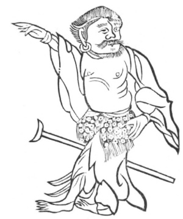

  
[Intangible Textual Heritage](../../index)  [Taoism](../index) 
[Index](index)  [Previous](kfu031)  [Next](kfu033) 

------------------------------------------------------------------------

  
*Kung-Fu, or Tauist Medical Gymnastics*, by John Dudgeon, \[1895\], at
Intangible Textual Heritage

------------------------------------------------------------------------

No. 4.—The Immortal with the Iron Crutch pointing the Way.—For the cure
of paralysis.

This disease is supposed by the Chinese to be caused by phlegm blocking
up the passages; that on the left is called *tan* (\#), that on the
right *hwan* (\#).

p. 157

 

Stand firmly, point with the right hand to the right, eyes to be
directed to the left, wove the air round in 24 mouthfuls. Let the left
foot point to the front, look to the right and left, move the air round
in 24 mouthfuls, then the right foot in front.

The Harmonizing Air Powder.

*Prescription*.—Take of ma-hwang (\#), Ephedra vulgaris; orange peel;
wu-yao (\#), Daphnidium myrrha; pai-chiang-ts‘an (\#), chw‘an-hiung,
pai-chih, of each 1 mace; liquorice, chieh-kêng (\#), Platycordon
grandiflorum, dried ginger, of each 5 candareens; chih-ch‘ioh 1 mace. To
be taken in boiled water, in which 3 slices of ginger have been
digested.

p. 158

"The Immortal with the Iron Staff" is included by Tauist writers in the
category of the Eight Immortals. His surname was Li. He is largely
represented in Chinese legendary lore. No precise period is assigned to
his existence upon earth. His disembodied spirit entered the body of a
lame and crooked beggar, and in this shape the philosopher continued his
existence, supporting his halting footsteps with an iron staff. Hence
his name, T‘ieh Kwai.

------------------------------------------------------------------------

[Next: No. 5.—The Maiden Immortal Ho slowly ascending to Heaven](kfu033)

