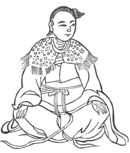

  
[Intangible Textual Heritage](../../index)  [Taoism](../index) 
[Index](index)  [Previous](kfu042)  [Next](kfu044) 

------------------------------------------------------------------------

  
*Kung-Fu, or Tauist Medical Gymnastics*, by John Dudgeon, \[1895\], at
Intangible Textual Heritage

------------------------------------------------------------------------

No. 15.—The Maiden Chang Chên-nü (\#) fixing her Animal Spirits.—To cure
emptiness and great pain of the heart.

 

p. 168

Sit upright, with the two hands press the knees, use the idea in it,
look to the right and elevate the left, move the air in 12 mouthfuls,
look to the left, raise the right, and move the air in 12 mouthfuls.

The Pain-removing Powder.

*Prescription*.—Take of wu-ling-chih (\#), magpie's dung, p‘u-hwang (\#)
roasted, Typha sp., tang-kwei, of each 1 ounce; jou-kwei, Cinnamomum
cassia, mu-hsiang, shih-ch‘ang-p‘u (\#), Acorus gramineus, of each 8
mace. Powder, boil, dose 4 mace, to be boiled with a little salt and
vinegar.

This corresponds with Amiot's No. 13, which is against the ills of the
heart, with fulness, grief and languor.

------------------------------------------------------------------------

[Next: No. 16.—Wei Po-yang's Method of beating the Wind](kfu044)

