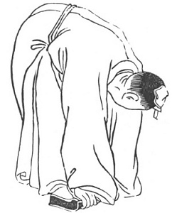

  
[Intangible Textual Heritage](../../index)  [Taoism](../index) 
[Index](index)  [Previous](kfu051)  [Next](kfu053) 

------------------------------------------------------------------------

  
*Kung-Fu, or Tauist Medical Gymnastics*, by John Dudgeon, \[1895\], at
Intangible Textual Heritage

------------------------------------------------------------------------

p. 177

No. 24.—Han Hsiang-tse’s (\#) [\*](#fn_11)
Figure for nourishing Man's Heart (\#).To cure curvature of the lumbar
spine and shaking (palsy) of the head.

 

Stand firmly, bend the head, curve the lumbar spine, and perform the act
of showing reverence. In doing this hung, let the hands and soles of the
feet be on the same level. Revolve the air in 24 mouthfuls.

p. 178

In one work the Figure is designated—"The Dragon wagging his Tail."—For
the cure of lumbago. Soup for expanding the small blood-vessels.

*Prescription*.—Take of ch‘iang-hwo, fang-chi (\#), roots and bulbs (?),
pai-shu, tang-kwei, pai-shao, chiang-hwang (\#), turmeric (Curcuma
longa), of each 1 ounce; liquorice 7 mace, hai-t‘ung-p‘i (\#), either
Acanthopanax, ricinifolium or Bombax malabaricum, 1 ounce. Dose 3 mace,
with 10 slices of ginger. Make a decoction.

------------------------------------------------------------------------

### Footnotes

[177:\*](kfu052.htm#fr_11) One of the Eight
Immortals of Tauist fable, and an ardent votary of transcendental study.
He was a pupil of the patriarch Lü, Mayers says, "and having been
carried up to the supernatural peach tree of the Genii he fell from its
branches, and in descending entered upon the state of immortality."

------------------------------------------------------------------------

[Next: No. 25.—Miss Chao-ling's manner of making disease go](kfu053)

