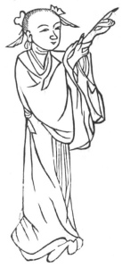

  
[Intangible Textual Heritage](../../index)  [Taoism](../index) 
[Index](index)  [Previous](kfu052)  [Next](kfu054) 

------------------------------------------------------------------------

  
*Kung-Fu, or Tauist Medical Gymnastics*, by John Dudgeon, \[1895\], at
Intangible Textual Heritage

------------------------------------------------------------------------

No. 25.—Miss Chao-ling's (\#) manner of making disease go.—To cure cold,
numbness, and extreme pain of the leg and foot.

 

p. 179

Stand erect, extend a finger of the left hand, with the right hand nip
the belly of the arm. Revolve the air in 24 mouthfuls.

A similar exercise is termed—The Patriarch Lü’s Method of causing the
blood and air to circulate.—For the cure of pain of the back and
shoulder.

Stretch out the left arm and press the inner aspect of the fore-arm with
the right hand, and *vice versâ*. Take 22 breaths.

The Fang-fêng T’ien-ma Powder.

*Prescription*.—Take of t'ien-ma (\#), Gastrodia elata, fang-feng,
liquorice, chw‘an-hiung, chiang-hwo, tang-kwei, pai-chïh, hwa-shih (\#)
Talc, of each 2 ounces; ts‘ao-wu-t‘ou (\#), Aconite, pai-fu-tse (\#),
Arisæma sp., ching-chieh-sui (\#), of each 5 mace. Powder, take warm
wine, and dissolve in a little honey, take ½ to 1 mace; and mix with it.
Take of this medicine until you feel slightly numb, and then stop.

------------------------------------------------------------------------

[Next: No. 26.—Lü Ch’un-yang’s Figure of sustaining the Pulse](kfu054)

