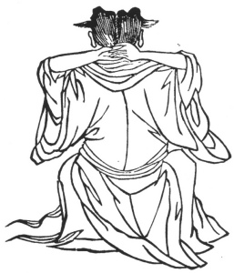

  
[Intangible Textual Heritage](../../index)  [Taoism](../index) 
[Index](index)  [Previous](kfu057)  [Next](kfu059) 

------------------------------------------------------------------------

  
*Kung-Fu, or Tauist Medical Gymnastics*, by John Dudgeon, \[1895\], at
Intangible Textual Heritage

------------------------------------------------------------------------

p. 183

No. 30.—Ch’ên Ni-wan’s Method of grasping the Wind's Nest (acupuncture
aperture below the occiput; see No. 7).—To cure want of clearness of the
brain, and rheumatism of the head.

 

Sit with the back to the outside, and let the two hands embrace the ears
and the back of the head. Revolve the air in 12 mouthfuls, and bring the
palms together 12 times.

The Ch'iang-hwo Pai-chih Soup.

Prescription.—Take of ch‘ai-hu, fu-ling, fang-fêng, ching-chieh,
hwang-lien, tsĕ-hsieh, tang-kwei, pai-shu, man-ching, gypsum,
ts‘ang-shu, hsin-i (\#) buds of Magnolia conspicua (or M. Kobus),
shêng-ti, chw‘an-hiung, kao-rên, liquorice, pai-chih, ch‘iang-hwo,
hwang-ch‘in, hsi-sin (\#), Asarum Sieboldi, shao-yao (same as pai-shao),
of each the same quantity. Add crude ginger, and make a decoction.

------------------------------------------------------------------------

[Next: No. 31.—Ts’ao Kwo-chieu taking off his Boots](kfu059)

