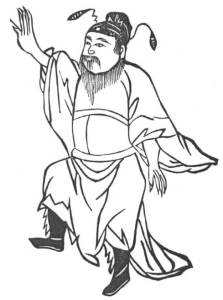

  
[Intangible Textual Heritage](../../index)  [Taoism](../index) 
[Index](index)  [Previous](kfu058)  [Next](kfu060) 

------------------------------------------------------------------------

  
*Kung-Fu, or Tauist Medical Gymnastics*, by John Dudgeon, \[1895\], at
Intangible Textual Heritage

------------------------------------------------------------------------

p. 184

No. 31.—Ts’ao Kwo-chieu (\#) [\*](#fn_13) taking
off his Boots.—To cure pain of the foot, calf of the leg and abdomen.

 

Stand firmly, place the right as if scaling a wall, let the left hand
hang down, direct the right foot in front, and step *in vacuo*. Revolve
the air 16 times. The left ' and right are the same.

p. 185

This exercise is elsewhere called—The Immortals taking off their
Shoes.—For the cure of lumbago.

The right foot is directed to be firmly planted on the ground and the
other slightly raised on the toes, and 18 breathings to be taken.

The Ch‘iang-hwo Soup for nourishing the exhausted.

*Prescription*.—Take of ch‘iang-hwo, chw‘an-hiung, ts‘ang-shu, pal-chïh,
nan-hsing (\#); Arisæma japonicum (?), tang-kwei, shên-ch’ü, of each 1
mace; sha-jên, kwei-chïh, bark of cassia twigs, fang-chi, mu-t’ung, of
each 8 candareens. Add 3 slices of ginger, and make a decoction.

------------------------------------------------------------------------

### Footnotes

[184:\*](kfu059.htm#fr_13) One of the Eight
Immortals of Tauist fable.

------------------------------------------------------------------------

[Next: No. 32.—Chao Shang-tsao’s Method of transferring and stopping the
ching](kfu060)

