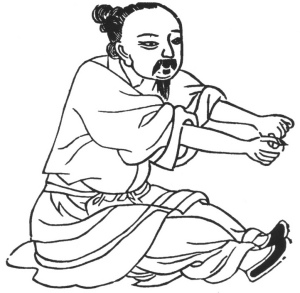

  
[Intangible Textual Heritage](../../index)  [Taoism](../index) 
[Index](index)  [Previous](kfu061)  [Next](kfu063) 

------------------------------------------------------------------------

  
*Kung-Fu, or Tauist Medical Gymnastics*, by John Dudgeon, \[1895\], at
Intangible Textual Heritage

------------------------------------------------------------------------

p. 188

No. 34.—Sun Hsuen-hsü (\#) imitating the Black Dragon taking hold of his
Claws.—To cure pain of the loins and legs.

 

Sit firmly on the ground, extend both feet, push out the two hands in
front and take hold of the two feet on the same level, and come and go
in this way performing the exercise. Revolve the air in 19 mouthfuls.

Elsewhere this exercise appears as—The Dragon grasping his Claws.—For
the cure of pain of the whole body.

Sit with the body straight, both feet extended together, close and open
alternately the fists, stretch forward the body along with the fists,
and take 12 mouthfuls.

Another is termed—The Tiger stretching his Claws.—For the cure of pain
of the back and limbs.

Sit upright with both legs crossed, stretch both arms to the front on a
level with the feet, move them backwards and forwards in this manner, so
that the air may follow the motions of the arms and thus be introduced
into the parts affected.

p. 189

The Niu-hsi Wine.

*Prescription*.—Take of ti-kuh-p‘i, wu-chia-p‘i (\#), Eleutherocrocus,
i-i-jên (\#), seeds of Coix lachryma (roasted), chw‘an-hiung, niu-hsi,
of each 2 ounces; liquorice, shêng-ti, 3 ounces; hai-t‘ung-p‘i (\#), 1½
ounces; ch‘iang-hwo 1 ounce; tu-chung (roasted), 2 ounces. Use good wine
without lees, to be well digested. Dose 1 or 2 cupfuls, 3 or 4 times
daily, to be drunk before the flavour of the wine has passed off.

------------------------------------------------------------------------

[Next: No. 35.—Kau Hsiang-sien’s imitation of the Phoenix  spreading its
Wings](kfu063)

