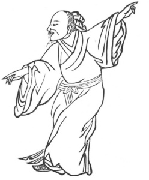

  
[Intangible Textual Heritage](../../index)  [Taoism](../index) 
[Index](index)  [Previous](kfu062)  [Next](kfu064) 

------------------------------------------------------------------------

  
*Kung-Fu, or Tauist Medical Gymnastics*, by John Dudgeon, \[1895\], at
Intangible Textual Heritage

------------------------------------------------------------------------

No. 35.—Kau Hsiang-sien’s (\#) imitation of the Phoenix [\*](#fn_14) spreading its Wings.—To cure diseases the
same as the preceding one.

 

p. 190

Bend and contract the body a little, raise the hand higher than the
vertex, let the mouth and nose slowly emit the pure air (!) in 3 or 4
mouthfuls, let the left foot be directed to the front, let the toes of
the right foot be opposed to the left heel, and revolve the air to
times.

The Flowing Air Potion.

*Prescription*.—Take of ch‘iang-hwo, ts‘ang-shu, chw‘an-hiung,
tang-kwei, hsiang-fu, pai-shao, orange peel, pan-hsia, mu-hsiang,
chïh-ch‘iöh, mu-t‘ung, liquorice, betel-nut, tze-su, of each the same
quantity. Make a decoction.

------------------------------------------------------------------------

### Footnotes

[189:\*](kfu063.htm#fr_14) A fabulous bird. The
male is termed *fêng*, and the female *kwang;* combined form the generic
designation of this wondrous bird, a compound between the peacock and
the pheasant, with the addition of many gorgeous colours. (See
illustration in the Year's Kung-fu).

------------------------------------------------------------------------

[Next: No. 36.—Fu Yuen-hsü embracing the Vertex](kfu064)

