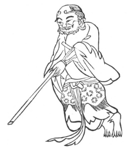

  
[Intangible Textual Heritage](../../index)  [Taoism](../index) 
[Index](index)  [Previous](kfu065)  [Next](kfu067) 

------------------------------------------------------------------------

  
*Kung-Fu, or Tauist Medical Gymnastics*, by John Dudgeon, \[1895\], at
Intangible Textual Heritage

------------------------------------------------------------------------

p. 192

No. 38.—Li T‘ieh-kwai the Immortal leaning on his Staff.—To cure pains
of the loins and back.

 

Place the hands to the back and stand firm, take the staff to buttress
the loins, let the left side lean on the staff, revolve the air 108
times, divide into 3 mouthfuls and swallow, afterwards kneel, swing from
aide to side as if sweeping the ground. Do it on the right side in like
manner.

This Figure is elsewhere called—The Immortal leaning on a Stick.—For the
cure of lumbago.

Take 18 mouthfuls 3 times, and move alternately the lags as if sweeping
the floor.

p. 193

The Tang-kwei Method of picking out Pain.

*Prescription*.—Take of ch‘iang-hwo, liquorice, hwang-ch‘in (digested in
wine), yin-ch‘in (\#), Artemisia sp., roasted in wipe, of each 5 mace;
k‘u-shên (\#) root of Sophora flavescens or gustifolia, ko-kên (\#),
Pachyrhisus angulatus, ts‘ang-shu, of each 2 mace; fang-fêng, kwei-shên
(clarified), chih-mu (washed in wine), ginseng, shêng-ma (\#), Astilbe
chinensis, fu-ling, tse-hsieh, chu-ling, of each 3 mace. Dose 8 mace,
made into a decoction with water, and no special time for taking it.

------------------------------------------------------------------------

[Next: No. 39.—The True Jade Immortal's method of harmonizing the Hall
of the Kidneys](kfu067)

