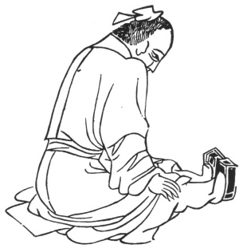

  
[Intangible Textual Heritage](../../index)  [Taoism](../index) 
[Index](index)  [Previous](kfu067)  [Next](kfu069) 

------------------------------------------------------------------------

  
*Kung-Fu, or Tauist Medical Gymnastics*, by John Dudgeon, \[1895\], at
Intangible Textual Heritage

------------------------------------------------------------------------

No. 40.—Li Ye-p‘o (\#) imitating the child reverencing.—To cure the same
as the preceding.

 

p. 195

Sit firmly, extend straight both feet, use pressure to the root of the
thighs, let the heart think, and revolve the air 13 times.

The Hai-t'ung-p‘i Potion.

*Prescription*.—Take hai-t‘ung-p‘i, wu-chia-p‘i, chw‘an-tu-hwo,
chïh-ch‘iöh, fang-fêng, tu-chung (roasted), niu-hsi (digested in wine),
i-i-jên (roasted), of each 1½ ounces. Put it into good wine, boil it to
drive off the "fire" and the poison; to be taken on an empty stomach.
Dose 5 mace.

------------------------------------------------------------------------

[Next: No. 41.—Lan Ts‘ai-ho imitating the Black Dragon shaking his
Horns](kfu069)

