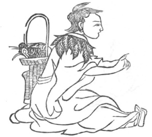

  
[Intangible Textual Heritage](../../index)  [Taoism](../index) 
[Index](index)  [Previous](kfu068)  [Next](kfu070) 

------------------------------------------------------------------------

  
*Kung-Fu, or Tauist Medical Gymnastics*, by John Dudgeon, \[1895\], at
Intangible Textual Heritage

------------------------------------------------------------------------

No. 41.—Lan Ts‘ai-ho (\#) [\*](#fn_15) imitating
the Black Dragon shaking his Horns.—To cure pain of the entire body.

 

p. 196

Sit upright, extend both feet, close firmly the two hands, and together
with the body direct them to the front, revolve the air in 24 mouthfuls,
place the feet on the ground, bend the head, let the two hands grasp the
toes of the two feet, and revolve the air as above.

The Soup to cause the Blood-vessels to circulate.

*Prescription*.—Take of hsuen-hu-so, tang-kwei, jou-kwei, of each 1
ounce; powder, mix with wine, and take 3 or 4 mace. Add wine according
to each individual's wine capacity; when the pain ceases, cease the
medicine.

------------------------------------------------------------------------

### Footnotes

[195:\*](kfu069.htm#fr_15) One of the Eight
Immortals who, according to Mayers, wandered about a beggar in a
tattered blue gown, with one foot shoelesss, wearing in summer wadded
garments and in winter sleeping on snow and ice. She waved a wand in her
hand, and chanted verses denunciatory of fleeting life and its delusive
pleasures.

------------------------------------------------------------------------

[Next: No. 42.—Hsia Yün-fêng imitating the Black Dragon in a horizontal
position on the Ground](kfu070)

