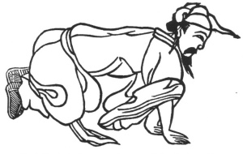

  
[Intangible Textual Heritage](../../index)  [Taoism](../index) 
[Index](index)  [Previous](kfu069)  [Next](kfu071) 

------------------------------------------------------------------------

  
*Kung-Fu, or Tauist Medical Gymnastics*, by John Dudgeon, \[1895\], at
Intangible Textual Heritage

------------------------------------------------------------------------

No. 42.—Hsia Yün-fêng (\#) imitating the Black Dragon in a horizontal
position on the Ground.—To cure pain of the back and spine.

 

Bend the body, creep on the ground, kneel, place the two hands on the
ground, revolve the air right and left 6 times.

A similar exercise is enjoined in that known as Using the Golden Block
to sodden the Earth.—For the cure of abdominal pain.

Both hands are raised above the head with the palms upwards as if
supporting heaven, and both heels are pressed firmly on the ground; the
arms are drawn down, and nine respirations are taken. (Compare No. 7 of
the Ornamental Sections).

p. 197

The Trinity or Three Harmonies Soup.

*Prescription*.—Take of orange peel, pan-hsia, fu-ling, wu-yao,
chïh-ch‘iöh, chw‘an-hiung, pai-chïh, ch‘iang-hwo, fang-fêng, hsiang-fu,
of each the same quantity, and make a decoction.

------------------------------------------------------------------------

[Next: No. 43.—Ho T‘ai-ku supporting Heaven, seated](kfu071)

