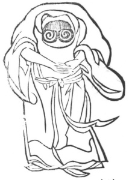

  
[Intangible Textual Heritage](../../index)  [Taoism](../index) 
[Index](index)  [Previous](kfu073)  [Next](kfu075) 

------------------------------------------------------------------------

  
*Kung-Fu, or Tauist Medical Gymnastics*, by John Dudgeon, \[1895\], at
Intangible Textual Heritage

------------------------------------------------------------------------

No. 46.—Chang Yao-yang (\#) imitating the Child worshipping the Goddess
of Mercy.—To cure pain in front and back of heart.

 

The body to assume the Chinese figure 8 (\#); bend the head as far as
the front of the chest, place the two hands on the abdomen, and revolve
the air 19 times.

p. 201

The Soup of the Two Oranges.

*Prescription*.—Take of chih-so (same as so-sha-mi), Amomum villosum,
pan-hsia, orange peel, chih-shïh, sha-jên, hsiang-fu, mu-hsiang,
hou-p‘o, hwei-hsiang, hsuan-hu, ts‘ao-tou-k‘ou, tze-su (stem and
leaves), of each the same quantity. Add ginger 3 slices, and make a
decoction.

------------------------------------------------------------------------

[Next: No. 47.—Tung Fang-shuo's Method of grasping his Big Toes](kfu075)

