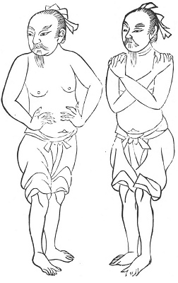

  
[Intangible Textual Heritage](../../index)  [Taoism](../index) 
[Index](index)  [Previous](kfu077)  [Next](kfu079) 

------------------------------------------------------------------------

  
*Kung-Fu, or Tauist Medical Gymnastics*, by John Dudgeon, \[1895\], at
Intangible Textual Heritage

------------------------------------------------------------------------

p. 212

### The Dragon Series.

The Dragon is the chief among the four divinely constituted beasts, a
legendary monster depicted by Chinese tradition as a four-footed reptile
resembling a huge saurian. The watery principle of the atmosphere is
pre-eminently associated with it. For a notice of the Dragon King see
the writer's article in *The Chinese Recorder*, on *Praying for Rain*
(Volume I, 1867).

No. 1.—The Dragon stamping the Earth, or The Stamping-Earth Dragon (and
so with all the other titles).

Let both hands embrace crosswise both shoulders; fix the toes on the
ground, and stamp with the heels 24 times. This is used for the
strengthening of the ligaments and bones. The stamping with the heel
causes the blood to circulate in heaven and earth, high and low (that
is, all over the body). The blood and air thus circulating everywhere,
boils, abscesses, etc., will not be produced. In this way, man can
voluntarily and gratuitously strengthen himself. [\*](#fn_19)

p. 213

No. 2.—The Dragon wagging his Tail.

 

p. 214

Place both legs firmly together, and move from side to side like a
dragon's tail, 24 times. For pacifying and making comfortable the
ligaments and bones. (These results are produced by the movement of the
coccyx).

No. 3.—The Dragon rubbing his Head.

Take hold of the Dragon with the left hand, and rub his head with the
right hand; seize it slowly, and afterwards move it firmly; do not be
afraid to repeat it any number of times. The black dragon is the liver,
and the white tiger is the lungs. By so manipulating, hardness will
disappear, and the dragon at the sight of the tiger will not be afraid.
(The illustration is similar to Nos. 1, 18, 23 and 29, of the Medicinal
Kung).

No. 4.—The Whirling-Wind Dragon.

With closed fists and head slightly bending downwards strike out first
the right hand and then the left, each hand following the other. This is
in order to more the bones and muscles, and cause the blood to advance
forwards, and so prevent the body from becoming weak. (The illustration
is similar to that for the Third month).

No. 5.—The Dragon joining his Feet.

Sitting straight place first one leg and then the other in the opposite
axilla, and with the hands grasp the opposite elbows. To cause the blood
to pass down the vertebrae to the kidneys and coccyx. (The illustration,
a male, is similar to No. 5, of the Medicinal Kung).

No. 6.—The Dragon shutting the Pass.

The hands to be lifted up with the palms towards heaven, and the air is
thus driven up to the head. To be done 24 times; and, if the air reach
to the *ni-wan* bone, [\*](#fn_20) the organs of
vision and hearing will be strengthened. (The illustration is similar to
No. 7, of the Eight Ornamental Sections).

p. 215

No. 7.—The Dragon closing in the Inspired Air.

Perfect quiet to be maintained, without which the exercise is useless.
To be done 81 times. To impart strength to men. (The illustration is
similar to Nos. 1, 20, 16, 21, 23, and 29, of the Medicinal Kung).

No. 8.—The Dragon supporting Heaven.

The object of this movement is to cause the air to pass from all parts
of the body to the coccyx. The person lies on his back, the heart is
empty (free from all care, etc.), the legs are drawn up, and the hands
clasped underneath, 81 times. By this *kung-fu* alone can the air freely
circulate to the coccyx.

No. 9.—The Ascending Dragon.

The person sits cross-legged, the breath is retained and drawn into the
abdomen, the mouth is closed and the tongue thrown against the palate.
Prescribed for driving out cold, with the hands in the loins, and
against incontinence of urine.

Inspire by the nose 90 times. If inspiration by the nose be not attended
to, the passages will be blocked up; and, if the mouth be not closed,
the dorsal muscles will be rendered uncomfortable; and, if the tongue be
not rubbed against the palate, the air from below will not pass to the
occiput, and all pass round like the flowing of the Yellow River and the
tides of the ocean and go into the heart.

There are three more given to complete the dozen, forming the "Dragon
Set:"—one, *The Dragon taking Water;* another, *The Dragon fearing
Fire;* and *The Dragon meditating on the Elixir*. These, not being very
different from some others already given, are omitted.

------------------------------------------------------------------------

### Footnotes

[212:\*](kfu078.htm#fr_19) These directions are
usually in rhyme, so as to be easily remembered and committed to memory.
The Chinese have no correct notion of the circulation of the blood. They
speak invariably of blood and air; and, together, these words stand for
the constitution. Original air is supposed to be mixed with the blood,
and to be the cause of its onward movement. (The position of the arms
resembles No. 3, Medicinal Kung).

[214:\*](kfu078.htm#fr_20) "Mud pellet bone," so
called from its containing the brain called the "mud pellet palace," and
this again from a reference in the Han dynasty to an official who, with
such a pellet, could close the Han Pass. (See the writer's *Anatomical
Vocabulary*,—"Ni-wan").

------------------------------------------------------------------------

[Next: The Tiger Series](kfu079)
