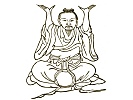

  
[Intangible Textual Heritage](../../index)  [Taoism](../index) 
[Index](index)  [Previous](kfu079)  [Next](kfu081) 

------------------------------------------------------------------------

  
*Kung-Fu, or Tauist Medical Gymnastics*, by John Dudgeon, \[1895\], at
Intangible Textual Heritage

------------------------------------------------------------------------

### Kneading.

Under this title we include all forms of friction, pressing, rubbing,
shampooing, massage, pinching etc. This method of cure and prevention of
disease is of very ancient origin. It has been revived in modern times
and is of growing importance, the practice being employed in a large and
ever-increasing number of diseases. From times immemorial the department
of pressing and rubbing *an-moh-k‘o* (\#) has been one of the 13
divisions of the great Medical College of China. This mode of treatment
is used when the skin, tendons and muscles are injured or when the bones
are fractured,

p. 221

or dislocated, or where the soft parts are swollen, hard or anæsthetic.
If the vessels become pervious and the air is no longer blocked up, this
method acts as a deiscutient and the disease is cured. The Medical
[College](errata.htm#12) of the present dynasty has only five officially
recognised departments; viz., medicine, surgery, children's diseases and
diseases of the mouth and eye. The other branches are forbidden and
particularly acupuncture which is not allowed to be practiced in the
Palace. The prevention and cure of disease by rubbing existed long
anterior to the Founder of Tauism. Its place seems afterwards to have
been taken by charms, incantations, magic and prayers, all of which,
along with *kung-fu*, alchemy and the elixir of immortality, are treated
together in the Tauist books.

In the volume from which we have taken the "divine" Surgeon Hwa-to's
"Five Animals" there is the following on Shampooing (pressing and
rubbing) called the Indian Method or that of Solomon, from the Sanskrit
*sala* (*Shorea robusta*) the immense tree under which Buddha was born
and died.

Grasp the hands and twist them as if washing them. Slightly interlock
the hands and turn them backwards and forwards towards the breast. Grasp
the hands and press them alternately on the right and left thigh. [\*](#fn_22) Let the hands act on both sides as if
drawing a bow of 5 piculs’ resistance. With both hands press heavily on
the thigh and slowly hoist the body on both sides. With firmly closed
fists push forward the hands alternately. Stretch the fists upwards and
downwards alternately to open the thorax.

p. 222

\[paragraph continues\] Act as if
supporting a stone on the palm. Turn the hands backwards land strike the
back on each side. Lay the hands on the ground and [lift](errata.htm#13)
up the body by bending the spine thrice. Embrace the head with the hands
and turn it on the thigh. This is to pull out the shoulders. Sit
sideways on the two sides alternately as if leaning against a hill. Sit
and stretch out alternately the feet and draw them forward in space. Lay
the hands on the ground and look backward on the right and left
alternately. This is termed the "tiger looking." Stand on the ground and
twist the body round thrice. Deeply interlock the hands and tread the
feet alternately in them. Stand erect and with the feet tread right and
left in space. Sitting, stretch out the legs and hook them alternately
at the knees.

These eighteen forms are to be practised thrice daily, and after one
month, even an aged person will become strong and walk as fast as a
galloping horse, will be able to eat, the eye will become bright, and
moreover, will never feel tired or contract illness.

The Pressing and Rubbing Method of Lau-tse (Tauist).

Press down heavily on the thigh with the hands on each side and twist
the body twice seven times. Press the thigh with the hands on each side
and twist the shoulder twice seven times Embrace the head with the hands
and twist the loins twice seven times. Shake the head twice seven times
and support it thrice. Embrace the head with one hand and support the
knee with the other and bend the body thrice on each side. Support the
head with one hand and the knee with the other from below directed
upwards three times on each side. Grasp the head directed downwards with
the hands and stamp the feet three times. Grasp the hands and pass them
over the head right and left three times. Interlock the hands, support
the heart in front (front of the breast) pushing out and turning them
back three times. Interlock the hands and press the heart three times.
Bend the wrist, buttress the ribs and draw back the elbow thrice on each
side. Draw back right and left side, pull forwards and backwards each
three times. Extend the hands, draw back the neck thrice on each side.
Lay the back of one hand on the

p. 223

knee and let the other draw back the elbow, then lay the palm on the
knee three times on each side. Let the hand press the shoulder from
above downwards and change the hands on each side. Push (the air) with
the empty [fists](errata.htm#14), (loosely closed) three times.
Interlock the hands and move them backwards and forwards reversing the
dorsa and palms three times. Move the hands outwards, inwards and
downwards each thrice. Rub and twist the finger thrice. Shake the hands
backwards (reversing the dorsa and palms) three times. Interlock the
hands and hoist the elbow up and down tines without number and exhale
the breath ten times only. Place the two hands together three times.
Lower the two hands three times. Interlock the hands and pass them over
the head expand the ribs on the right and left ten times. Turn the fists
backwards and rub the spine up and down three times. Turn the hands and
grasp the ridge straight up and down three times. Pronate the palm, take
hold of the wrist and move it inwards and outwards thrice. Pronate the
palm and raise it in front three times. Pronate the palm and interlock
the two hands and move them horizontally three times. Pronate the palm
in a straight horizontal position and lift them up three times. If the
hands get cold beat them from above down-wards until they become warm.
Extend the left foot and support it with the right hand, the right and
left taking hold of the foot, from above downwards and straighten the
foot three times. Let the right hand take hold of the foot, the same as
the other. Whirl the foot backwards and forwards three times. Whirl the
foot to the left, and to the right each three times. Whirl the foot
backwards and forwards three times. Straighten the feet three times.
Twist the thigh three times. Shake the foot inwards and outwards three
times. If the foot gets cold, beat it until warm. Twist the thigh so
many times and stamp the feet three times and straighten them three
times. Act like a tiger on the right and left and twist the shoulder
three times. Push the heavens and support the earth right and left three
times. Swing (like a pendulum) a mountain right and left, carry (on the
back) a hill, and pull up a tree, each three times. Extend the hands and
twist them straight in front three times, knees and feet each three
times. Twist inwards and outwards the spine each thrice. (For further
remarks on this method see further on).

p. 224

The patriarch of Pêng says that by rubbing the face and ears with the
hands every morning, the vigour of the face will then flow everywhere.
Again by rubbing the hands until they get warm, and then rubbing the
face, it will look bright and he able to bear the cold without
suffering. He also says that the man who wishes to harmonize the breath
must take a room, shutting the window and door, with a warm mat, a high
pillow and the body reclining perfectly straight, shut up the eyes and
the breath in the chest, and put a feather on the nose so that it does
not move and after 300 breaths, the eyes will not see, the ears will not
hear (will become insensible) and thus nether cold not heat will come
nigh the body and no poisonous insects will deposit their virus on it,
and the person will attain to the age of 360 years and thus become a
neighbour of the genii. Every morning and evening with the face towards
the South, place the hands on the feet and the knees, knead the joints
gently, exhale the foul breath by the mouth, and inhale the pure air by
the nose, and with the hands right and left, support the abdomen in
front and behind, above and below. After a while, open the mouth, knock
the teeth, wink the eyes, press the head, pull the ears, curl up the
hair, loose the loins and cough in order to develop and excite the
breath. Turn the hands and using the idea stamp the feet eighty or
ninety times and then stop. Settle the heart slowly, preserve the
thought like a Buddhist priest, shut the eyes and you will then see the
original air come down as a canopy of distinctly different (5) colours
gradually to the head, pass through the skin, to the flesh, the bones,
the brain and finally to the abdomen and all the inferior viscera will
derive benefit from it like the absorption of water. When the *ku ku*
noise is heard in the abdomen, then keep the thought and do not let it
communicate with external things, so the original air will be
transported to the "sea of air" (\#), and finally to the *yung chuen*
(\#), (acupuncture aperture on the inner aspect of the sole of the foot
between the heel and great toe) and the body be excited. It is to be
done once or twice a day up to as many as three to five times, when the
effect will be that the body will feel pleasant, the face appear bright,
the hair glossy, the ear and the eye become clear and intelligent, and
the strength of the air become robust and all diseases be removed. If it
could be performed 5,000 or 10,000 times without stopping up

p. 225

to the full 100,000 times, the Kung-fuist is not far from the genii. And
thus it comes about that the body is full of the suitable air free from
sickness, otherwise all manner of disease will be engendered. Whoever,
therefore, wants to improve his health must know how to harmonize the
breath. It may he held after midnight and before noon, when the air is
alive and can be profitably harmonized; in the afternoon or before
midnight the air is dead and unprofitable. By lying on the back on thick
and warm bedding, high pillow, keep the body even, stretch out the hands
and feet, bend the joints of the thumb 4 or 5 inches apart from the body
and the feet the same distance apart from each other, knock the teeth
frequently and swallow the saliva, breathe air through the nose into the
abdomen until full, after awhile, gradually exhale from the mouth and
repeat the process continuously. Where there is a heavy fog, had wind
and extreme cold, the breath should not be inhaled. When one has caught
a cold and is feverish or has malignant boils, the kung must be
performed at once, no matter what the time may be, and continued until
cured. Another of the Tauist patriarchs, Ju Hsü, says that at cock
crowing we should rise, sit on the bed and guide (refine) the breath;
when finished and the toilet completed we should sit straight and
according to the season, whether cold or hot take some refreshment;
before partaking, a little medicinal wine is to be drunk. After it has
dispersed, enter some quiet place, burn incense and purify the heart,
after which read or chant prayers or charms and thoroughly wash away
every thought of anger, grief, care etc., from the heart; after a little
while, go out into the courtyard, slowly take step after step, letting
off the breath. If the ground be damp the walking must be intermitted.
Take 5 steps outside the room to disperse the air, pass the management
of all domestic affairs to your son and thus set the heart free from all
family cares. If the heart cannot be made and kept pure at home, then
seek a retreat elsewhere, whether 50 or 100 *li* distant, and daily
contemplate peace, and what is needed there, let some of the family
bring it, etc.

The patriarch Shih-shih says, after meals fist rub the abdomen with a
warm hand and walk 50 or 60 steps; repeat the operation after the midday
meal and walk 100 or 200 steps but never walk hastily to cause panting,
and return to the couch and lie down, extend the limbs but do not sleep,
after the breath becomes settled, sit up and take

p. 226

some medicinal articles such as dates, ginsing, China-root and liquorice
in a decoction, and when a degree of warmth is experienced, take a
decoction of bamboo leaves, imperata arundinacea (*ophiopogon
japonicus*); and when the stomach is full do not walk quickly and when
it is empty do not use the voice to call or use one's breath.

The patriarch, Chung Cheng, says, that man ought not only to know how to
take his proper food but also to know how to harmonize the body by
rubbing and kneading, moving the joints and guiding the breath. The
importance of the latter is to keep it moving so as not to become an
obstruction.

------------------------------------------------------------------------

### Footnotes

[221:\*](kfu080.htm#fr_22) The pi (\#) which
occurs frequently in these directions for Shampooing is the thigh. It is
the same as pi (\#) which is the, same as pi (\#) the thigh. Pi ch‘ih
(\#) is the stomach. See foot note year's Kung, first month.

------------------------------------------------------------------------

[Next: Books on Kung-fu](kfu081)
