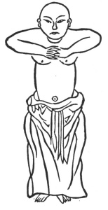

  
[Intangible Textual Heritage](../../index)  [Taoism](../index) 
[Index](index)  [Previous](kfu086)  [Next](kfu088) 

------------------------------------------------------------------------

  
*Kung-Fu, or Tauist Medical Gymnastics*, by John Dudgeon, \[1895\], at
Intangible Textual Heritage

------------------------------------------------------------------------

p. 255

### The Twelve Positions.

1.—The First Aspect of Wei-to (a Deva or inhabitant of heaven, a deity
of Hindoo mythology who protects the Buddhist religion, and three of the
four continents into which the world is divided. It is the name of the
Bodhisattwa (he who knows and feels) a general under the Four great
kings who stands in the front hall of all Buddhist monasteries),
offering the Pestle.

 

p. 256

Stand upright; form a ring with the hands and apply them to the heart;
fix the breath and gather in the spirit (energy) with a pure heart and
respectful countenance. See No. 1.

------------------------------------------------------------------------

[Next: 2.—The Second Aspect of Wei-to](kfu088)

