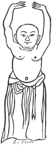

  
[Intangible Textual Heritage](../../index)  [Taoism](../index) 
[Index](index)  [Previous](kfu088)  [Next](kfu090) 

------------------------------------------------------------------------

  
*Kung-Fu, or Tauist Medical Gymnastics*, by John Dudgeon, \[1895\], at
Intangible Textual Heritage

------------------------------------------------------------------------

p. 257

3.—The Third Aspect of Wei-to.

 

Support with the palms Heaven's door and look upward.

The toes fix on the ground and stand upright.

Let energy circulate to the legs and ribs to make them stand firm.

Close firmly the jaws and do not let them loose.

The [tongue](errata.htm#27) can produce saliva if it reach the palate.

The heart will have peace if the breath by the note be equalized.

Let the two fists gradually return to their original place.

Exert the strength as if about to carry heavy objects. See No. 3.

------------------------------------------------------------------------

[Next: 4.—Taking away a star and changing the Dipper for it](kfu090)

