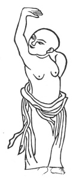

  
[Intangible Textual Heritage](../../index)  [Taoism](../index) 
[Index](index)  [Previous](kfu089)  [Next](kfu091) 

------------------------------------------------------------------------

  
*Kung-Fu, or Tauist Medical Gymnastics*, by John Dudgeon, \[1895\], at
Intangible Textual Heritage

------------------------------------------------------------------------

p. 258

4.—Taking away a star and changing the Dipper for it.

 

Support heaven and cover the head with one hand.

Fix the eyes and look through the palms.

Exert the strength and turn back, on each side alike. See No. 4.

------------------------------------------------------------------------

[Next: 5.—Pulling Nine Oxen's tails backwards](kfu091)

