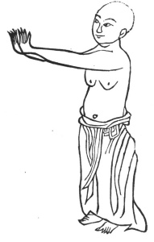

  
[Intangible Textual Heritage](../../index)  [Taoism](../index) 
[Index](index)  [Previous](kfu091)  [Next](kfu093) 

------------------------------------------------------------------------

  
*Kung-Fu, or Tauist Medical Gymnastics*, by John Dudgeon, \[1895\], at
Intangible Textual Heritage

------------------------------------------------------------------------

p. 260

6.—Pushing out the Claws and Extending the Wings.

 

Fix the body and let the eyes be angry.

Push the hands forward in front of the chest.

With strength turn back

Seven times to complete the exercise. See No. 6.

------------------------------------------------------------------------

[Next: 7.—Nine Devils drawing a dagger](kfu093)

