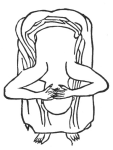

  
[Intangible Textual Heritage](../../index)  [Taoism](../index) 
[Index](index)  [Previous](kfu096)  [Next](kfu098) 

------------------------------------------------------------------------

  
*Kung-Fu, or Tauist Medical Gymnastics*, by John Dudgeon, \[1895\], at
Intangible Textual Heritage

------------------------------------------------------------------------

p. 265

11.—Making a Bow.

 

Holding the head by the hands.

Bend the waist to between the knees.

Stretch the head to between the legs.

Close the jaws very tightly.

Cover up the ears to the sense of hearing as if something were inserted
in them.

Arrange in a restful condition the original air.

Attach the tip of the tongue firmly to the palate.

And exert the force at the bending elbow. See No. 11.

------------------------------------------------------------------------

[Next: 12.—Wagging the Tail](kfu098)

