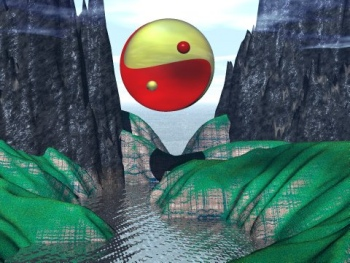

  
[Intangible Textual Heritage](../../index)  [Taoism](../index) 

------------------------------------------------------------------------

[Buy this Book at
Amazon.com](https://www.amazon.com/exec/obidos/ASIN/B0026P3TA0/internetsacredte)

------------------------------------------------------------------------

<table width="75%">
<colgroup>
<col style="width: 50%" />
<col style="width: 50%" />
</colgroup>
<tbody>
<tr class="odd">
<td width="50%" data-valign="TOP"></td>
<td width="50%" data-valign="CENTER"><h1 id="laotzus-tao-and-wu-wei" data-align="CENTER">Laotzu's Tao and Wu Wei</h1>
<h3 id="by-dwight-goddard-and-henri-borel" data-align="CENTER">By Dwight Goddard and Henri Borel</h3>
<h4 id="section" data-align="CENTER">[1919]</h4></td>
</tr>
</tbody>
</table>

------------------------------------------------------------------------

[Contents](#contents)    [Start Reading](ltw00)    [Page
Index](pageidx)    [Text \[Zipped\]](ltw.txt.gz)

|                                                                                                                           |
|---------------------------------------------------------------------------------------------------------------------------|
|  |

------------------------------------------------------------------------

Why post yet another translation of the Tao te Ching? This one is by
Dwight Goddard, the author of [A Buddhist Bible](../../bud/bb/index),
and it is a very transparent and readable version. This translation was
the predecessor of one which Goddard slipped into later editions of the
Buddhist Bible, one of the few explicitly non-Buddhist texts in that
collection. The versions of the Tao te Ching already online are by 19th
century scholars who, although very capable, tend to be a bit pedantic.
The concepts of Taoism are very lucid, and wrapping them in too much
verbiage, as Legge *et al* did, add an unneeded layer of obscurity.
Goddard, who was a Zen Buddhist and studied eastern philosophy
extensively, comes much closer to the essence of the text, even if he
occasionally moves portions of it around. This book also includes a
translation of an extended essay by Henri Borel on Taoist philosophy and
aesthetics.

--John Bruno Hare, September 17th, 2004.

Note: [the second edition of this book](../ltw2/index), published in
1939, with a very different translation of the Tao te Ching, is also
available at this site.

------------------------------------------------------------------------

[Tao Teh King \[Goddard\]](#section_000)    [Wu Wei
\[Borel\]](#section_001)

------------------------------------------------------------------------

[Title Page](ltw00)  
[Introduction](ltw01)  
[All we know about Laotzu](ltw02)  

### Tao Teh King

[I. What is the Tao](tao01)  
[II. Self-Development](tao02)  
[III. Quieting People](tao03)  
[IV. Tao, Without Origin](tao04)  
[V. Impartiality](tao05)  
[VI. The Infinitude of Creative Effort](tao06)  
[VII. Humility](tao07)  
[VIII. The Nature of Goodness](tao08)  
[IX. Moderation](tao09)  
[X. What is Possible](tao10)  
[XI. The Value of Non-Existence](tao11)  
[XII. Avoiding Desire](tao12)  
[XIII. Loathing Shame](tao13)  
[XIV. In Praise of the Profound](tao14)  
[XV. That Which Reveals Teh](tao15)  
[XVI. Returning to the Source](tao16)  
[XVII. Simplicity of Habit](tao17)  
[XVIII. The Palliation of the Inferior](tao18)  
[XIX. Return to Simplicity](tao19)  
[XX. The Opposite of the Commonplace](tao20)  
[XXI. The Heart of Emptiness](tao21)  
[XXII. Increase by Humility](tao22)  
[XXIII. Emptiness and Not-Doing (Wu Wei)](tao23)  
[XXIV. Troubles and Merit](tao24)  
[XXV. Describing the Mysterious](tao25)  
[XXVI. The Virtue (Teh) of Dignity](tao26)  
[XXVII. The Function of Skill](tao27)  
[XXVIII. Returning to Simplicity](tao28)  
[XXIX. Not Forcing Things (Wu Wei)](tao29)  
[XXX. Be Stingy of War](tao30)  
[XXXI. Avoiding War](tao31)  
[XXXII. The Virtue (Teh) of Holiness](tao32)  
[XXXIII. The Virtue (Teh) of Discrimination](tao33)  
[XXXIV. The Perfection of Trust](tao34)  
[XXXV. The Virtue (Teh) of Benevolence](tao35)  
[XXVI. Explanation of a Paradox](tao36)  
[XXXVII. Administering the Government](tao37)  
[XXXVIII. A Discussion About Teh](tao38)  
[XXXIX. The Root of Authority](tao39)  
[XL. Avoiding Activity](tao40)  
[XLI. The Unreality of Appearance](tao41)  
[XLII. The Transformation of Tao](tao42)  
[XLIII. The Function of the Universal](tao43)  
[XLIV. Precepts](tao44)  
[XLV. The Virtue (Teh) of Greatness](tao45)  
[XLVI. Limitation of Desire](tao46)  
[XLVII. Seeing the Distant](tao47)  
[XLVIII. To Forget Knowledge](tao48)  
[XLIX. The Virtue (Teh) of Trust](tao49)  
[L. Esteem Life](tao50)  
[LI. Teh As A Nurse](tao51)  
[LII. Return to Origin](tao52)  
[LIII. Gain By Insight](tao53)  
[LIV. To Cultivate Intuition](tao54)  
[LV. To Verify the Mysterious](tao55)  
[LVI. The Teh of the Mysterious](tao56)  
[LVII. The Habit of Simplicity](tao57)  
[LVIII. Adaptation to Change](tao58)  
[LIX. To Keep Tao](tao59)  
[LX. To Maintain Position](tao60)  
[LXI. The Teh of Humility](tao61)  
[LXII. The Practice of Tao](tao62)  
[LXIII. A Consideration of Beginnings](tao63)  
[LXIV. Consider the Insignificant](tao64)  
[LXV. The Teh of Simplicity](tao65)  
[LXVI. To Subordinate Self](tao66)  
[LXVII. Three Treasures](tao67)  
[LXVIII. Compliance With Heaven](tao68)  
[LXIX. The Function of the Mysterious](tao69)  
[LXX. The Difficulty of Understanding](tao70)  
[LXXI. The Disease of Knowledge](tao71)  
[LXXII. To Cherish One's Self](tao72)  
[LXXIII. Action is Dangerous](tao73)  
[LXXIV. Overcoming Delusions](tao74)  
[LXXV. Loss By Greediness](tao75)  
[LXXVI. Beware of Strength](tao76)  
[LXXVII. Tao Of Heaven](tao77)  
[LXXVIII. Trust and Faith](tao78)  
[LXXIX. Enforcing Contracts](tao79)  
[LXXX. Contentment](tao80)  
[LXXXI. The Nature of the Essential](tao81)  
[Valedictory. Part of the 20th Sonnet](tao82)  

### Wu Wei

[Preface](ltw85)  
[Contents of Wu Wei, by Henri Borel](ltw86)  
[Chapter I. Tao](ltw87)  
[Chapter II. Art](ltw88)  
[Chapter III. Love](ltw89)  
[Notes](ltw90)  
